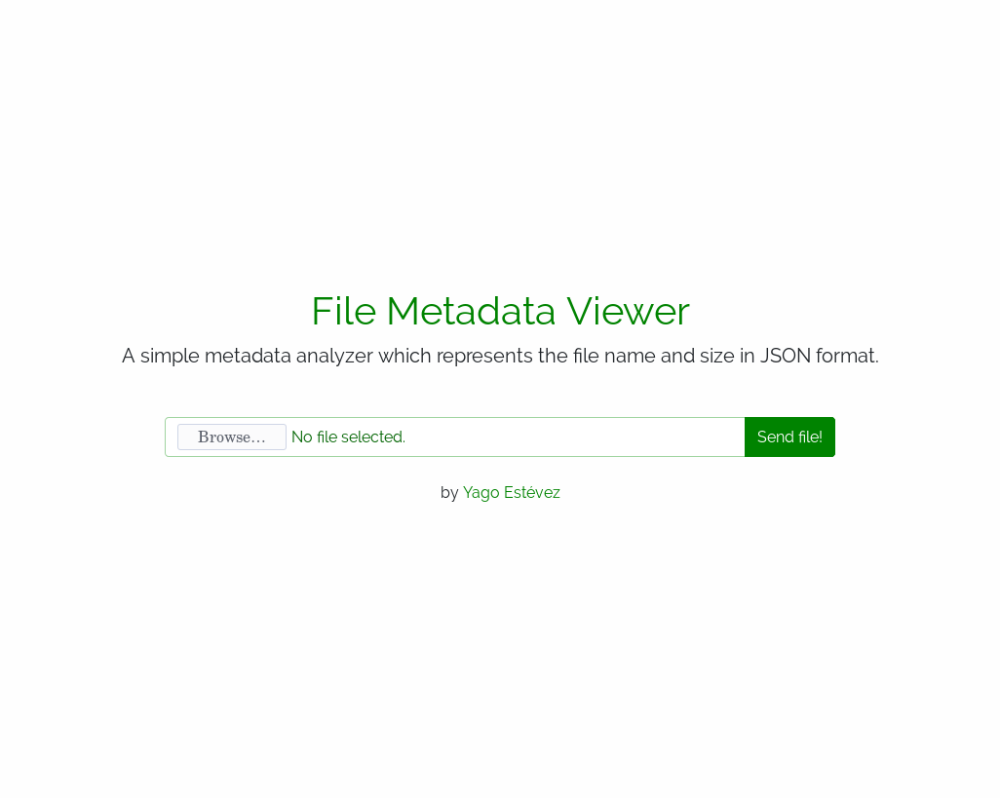

# FILE METADATA VIEWER
#### A project made for APIs & Microservices Module at FreeCodeCamp
----

> #### WORK IN PROGRESS

A project made for **APIs & Microservices Module** at FreeCodeCamp.

#### User Stories

1. I can submit a form that includes a file upload.
2. The from file input field has the "name" attribute set to "upfile". We rely on this in testing.
3. When I submit something, I will receive the file name and size in bytes within the JSON response

#### Screenshot

This is how the UI looks like:

#### Try it
Check a real working example using this API on the following link.
[https://yagoestevez-file-metadata-viewer.glitch.me/](https://yagoestevez-file-metadata-viewer.glitch.me/)

---
[Yago Estévez](https://twitter.com/yagoestevez)